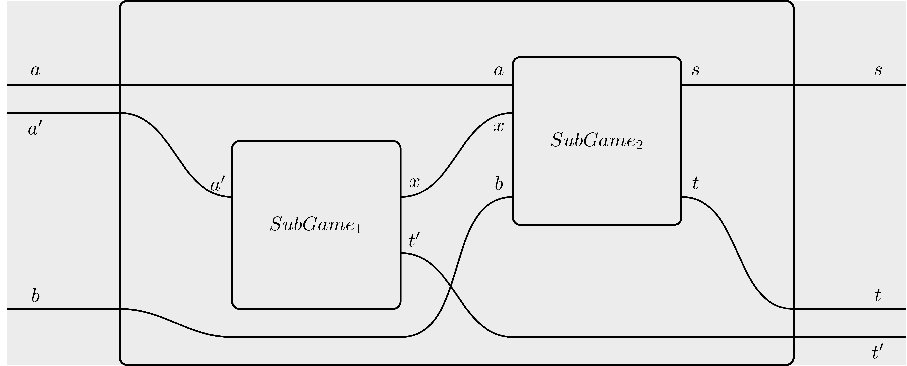

# Table of contents
- [Summary](#summary)
    - [Analytics results](#analytics-results)
- [Installation](#installation)
    - [Normal execution](#normal-execution)
    - [Interactive execution](#interactive-execution)
    - [Addendum: Installing haskell](#addendum-installing-haskell)
        - [Installing through `nix` (recommended)](#installing-through-nix-recommended)
          - [Installing `nix`](#installing-nix)
          - [Setting up the environment](#setting-up-the-environment)
          - [Freeing space](#freeing-space)
        - [Installing through GHCup](#installing-through-ghcup)
- [Explaining the model](#explaining-the-model)
- [Code deep dive](#code-deep-dive)
    - [Recap: DSL primer](#recap-dsl-primer)
        - [The building blocks](#the-building-blocks)
        - [Exogenous parameters](#exhogenous-parameters)
        - [Basic operations](#basic-operations)
        - [Branching](#branching)
        - [Supplying strategies](#supplying-strategies)
            - [Evaluating strategies](#evaluating-strategies)
            - [Stochasticity](#stochasticity)
            - [Branching](#branching-1)
    - [File structure](#file-structure)
- [Analytics](#analytics)
    - [Strategies employed in the analysis](#strategies-employed-in-the-analysis)
    - [Reading the analytics](#reading-the-analytics)
    - [Running the analytics](#running-the-analytics)
    - [Main findings](#main-findings)


# Summary
In this work, we modelled some of the basic functionality of


## Analytics results
The analytics we implemented are very basic, and should be considered little more than sanity checks. They showed that:

- Users have no interest in adding and immediately removing liquidity if they do not gain some exogenous payoff from this action. This means that bundling add/remove liquidity transactions to emulate [JIT liquidity](https://papers.ssrn.com/sol3/papers.cfm?abstract_id=4382303) is not going to be profitable if the surrounding context does not provide a payoff that depends strictly on this action.
- Profiting from arbitraging swaps is in principle possible. This is not surprising.

# Installation
To run the model, it is necessary to have `haskell` and `stack` installed on your machine. Refer to the subsection [Addendum: Installing haskell](#addendum-installing-haskell) for instructions. A deeper dive into the code structure can be found in the [Code deep dive](#code-deep-dive) subsection.

There are two main ways of running the model: normal and interactive execution.


## Normal execution
To 'just' run the model, type

```sh
stack run
```
in the main directory, where the file `stack.yaml` is located.
The model will be compiled and a predefined set of analytics will be run. The results of the predefined analytics will be shown on terminal.


## Interactive execution
One of the most powerful features of `haskell` is *REPL mode*. This allows you to recompile the code on the fly, to query the type of a function and a lot of other things. To start interactive mode, just run

```sh
stack ghci
```

in the main directory. The code will compile, and then an interactive terminal (REPL) window will open. There are various commands that can be fed to the REPL. Among the most useful ones we highlight:

| Command         | Description               |
|:----------------|--------------------------:|
| `:q`            | quit interactive mode     |
| `:r`            | recompile the source code |
| `:l module`     | load module               |
| `:t expression` | query expression type     |

Of these commands, `:t` is the most important one, as it allows to visualize clearly what type of input we must feed to a given function. For instance, `:t (&&)` produces the output:

```haskell
(&&) :: Bool -> Bool -> Bool
```
Which tells us that `(&&)` - the logical `and` operator - takes a boolean (a truth value), then another boolean, and returns a boolean (the logical `and` of the first two).

Since under the hood games are nothing more than functions, REPL allows us to see the game type by doing `:t gameName`. If the game is parametrized, say, over a string, then `:t gameName "string"` will return the type where the first component has already been filled.

This tool is expecially powerful to better understand the structure of the strategies we have to feed to the model, which can grow very complicated as the model scales.


## Addendum: Installing haskell

If you dont' have either `haskell` or `stack`, it is necessary to install them. There are many ways to do so, of which we propose two: The first one, which we recommend, is through the [`nix`](https://nixos.org/download.html) package manager. The second one, is via [`GHCup`](https://www.haskell.org/ghcup/).

### Installing through `nix` (recommended)

[`nix`](https://nixos.org/download.html) is a package manager that allows to build environments deterministically. This means that it offers the right granularity to set up a developing environment exactly as one wants it. All of our projects get shipped together with something called a *`nix` flake*, which is a set of instructions telling `nix` to install all needed dependencies precisely at the version we used during development. This drastically reduces the possibility of compiling/execution errors and it is why we strongly recommend using `nix`.

#### Installing `nix`

To install `nix`, type the following command in a terminal:

```sh
curl --proto '=https' --tlsv1.2 -sSf -L https://install.determinate.systems/nix | sh -s -- install
```

Please note that on windows this will require installing [WSL2](https://en.wikipedia.org/wiki/Windows_Subsystem_for_Linux) first. 

#### Setting up the environment

Now that `nix` is up and running, we can fire up the environment. In a terminal, navigate in the main repo folder, where `flake.nix` is. Before running any command, type

```sh
nix develop
```

This will create a reproducible ephemeral devshell exposing all the required dependencies for running the project (slack, ghc, haskell-language-sever). Please note that this will take around 7GB of space.

While in the devshell, you can proceed as in [Normal execution](#normal-execution) and [Interactive execution](#interactive-execution). When you're done trying out the model, you can type

```sh
exit
```

or close the terminal window to exit from the devshell.

#### Freeing space

If you do not plan to use the model in the foreseeable future and want to reclaim some hard-disk space, in a terminal (outside the `nix develop` environmnet) just give:

```sh
nix-collect-garbage
nix store optimise
```

### Installing through `GHCup`

Another way to set up the environment to run the project is via [`GHCup`](https://www.haskell.org/ghcup/).
In a terminal, type:

```sh
 curl --proto '=https' --tlsv1.2 -sSf https://get-ghcup.haskell.org | sh 
```

If asked, respond 'yes' (`Y`) to the following questions:

```
Do you want to install haskell-language-server (HLS)?
Do you want to enable better integration of stack with `GHCup`?
```

Afterwards, `GHCup` may ask you to install some additional packages before continuing with the installation. Follow the advice before continuing. Then, just follow the instructions through the end.

Again, the installation is quite massive in terms of space. In this respect, `GHCup` is a convenient solution in that it installs only in one folder (on Linux systems, `/home/$USER/.ghcup`). Should you decide to get rid of `haskell` altogether, just delete the folder.

Again, once `GHCup` has installed, you can proceed as in [Normal execution](#normal-execution) and [Interactive execution](#interactive-execution).

**A note of warning:** GHC, the `haskell` compiler installed with `GHCup`, relies heavily on the GCC compiler. GHC assumes that GCC comes together with all the relevant libraries. As such, in compiling the model you may get errors such as:

```sh
/usr/bin/ld.gold: error: cannot find -ltinfo
```

these errors hint at missing GCC libraries, which will have to be installed independently. The precise iter to do so depends on the libraries involved and on your operating system. Unfortunately there is little we can do about it, as this is a problem with the general `haskell` developer infrastructure.

The main way to avoid this is by using the recommended installation via [`nix`](#installing-through-nix-recommended).


# Explaining the model
Here we give a more detailed explanation of what our model does.

The model implements the functions to add/remove liquidity and to swap assets, as provided in the [codebase](https://github.com/askibin/perpetuals/tree/master/programs/perpetuals/src). These games can be used without any problem. These games are defined in `Components.hs` (see [File structure](#file-structure) for more information).

We defined games also to open, close and liquidate positions, and to deposit or withdraw collateral. At the moment, these games are placeholders of the correct signatures, but the needed functions to complete their implementation have yet to be ported from the original codebase. This is work was not included in our work package, and can be carried out in-house or by us in a subsequent Work Package. Again, these games are defined in `Components.hs`

Finally, we provided some example games made by assemblig the basic building blocks we created. These games are contained in `Model.hs`. They include:

- A game where liquidity is added and immediately removed
- A game as above, but where the player also receives some exogenous payoff in performing this action
- Two simple games to model arbitrages between two different pools.

# Code deep dive


## Recap: DSL primer
Our models are written in a custom DSL compiled to `haskell`. Here we give a brief description of how our software works.

### The building blocks
The basic building block of our model is called **open game**, and can be thought of as a game-theoretic lego brick. This may represent a player, a nature draw, a payoff matrix or a complex combination of these elements. It has the following form:

```haskell
gameName variables = [opengame|

   inputs    : a;
   feedback  : b;

   :----------------------------:

   inputs    : a';
   feedback  : b';
   operation : content;
   outputs   : s';
   returns   : t';

   :----------------------------:

   outputs   :  s;
   returns   :  t;
  |]
```

We can imagine this block as a box with 4 wires on its outside, on which travels information marked as:
- `inputs`, data that gets fed into the game (e.g. a player receiving information from a context).
- `outputs`, data that the game feeds to the outside world (e.g. a player communicating a choice to another player).
- `returns`, the returns of a player actions, which are usually directly fed to a function calculating payoffs.
- The `feedback` wire which sends information back in time. If, intuitively, `returns` represents the returns on a player action, one could imagine it as 'information that an agents receive from the future'. `feedback` is the dual analog of that: If a given piece of information comes from the future, someone in the future must have been sent it to the past. For additional details about the `feedback` wire please refer to the relevant [literature](https://arxiv.org/abs/1603.04641).

The `:--:` delimiters separate the outside from the inside of the box. As one can see, the interfaces inside are replicated. This is intentional as it allows for a notion of *nesting*. For instance, the situation depicted in the following picture:



Can be represented by the following code block:

```haskell
gameName variables = [opengame|

   inputs    : a, a';
   feedback  : b;

   :----------------------------:

   inputs    : a';
   feedback  : ;
   operation : SubGame1;
   outputs   : x;
   returns   : t';

   inputs    : a, x;
   feedback  : b;
   operation : SubGame2;
   outputs   : s;
   returns   : t;
   :----------------------------:

   outputs   :  s;
   returns   :  t,t';
  |]
```

In turn, `Subgame1` and `Subgame2` can be other games defined using the same DSL. Notice that the wire `x` is internal and totally hidden from the 'outside world'. 

### Exogenous parameters
An exogenous parameter is a given assumption that is not part of the model, and is fed to it externally. As such, it is treated by the model as a 'fact' that cannot really be modified. An example of exogenous parameter could be the market conditions at the time when a game is played.

Exogenous parameters are just defined as variables, as the field `variables` in the previous code blocks testifes. These variables can in turn be fed as exogenous parameters to inside games, as in the following example:

```haskell
gameName stock1Price stock2Price  = [opengame|

   inputs    : a, a';
   feedback  : b;

   :----------------------------:

   inputs    : a';
   feedback  : ;
   operation : SubGame1 stock1Price;
   outputs   : x;
   returns   : t';

   inputs    : a, x;
   feedback  : b;
   operation : SubGame2 stock2Price;
   outputs   : s;
   returns   : t;
   :----------------------------:

   outputs   :  s;
   returns   :  t,t';
  |]
```

### Basic operations
In addition to the DSL defining the 'piping rules' between boxes, we provide some *basic operations* to populate a box, namely:
- A *function*, which just transforms the input in some output.
- A *stochastic distribution*, used to implement draws from nature.
- A *strategic choice*, which can be thought of as a function parametrized over strategies.

### Branching
Another important operation we provide is called *branching*. This is useful in contexts where, say, a player choice determines which subgame is going to be played next.
Branching is represented using the operator `+++`. So, for instance, if `SubGame1` is defined as ```branch1 +++ branch2```, then we are modelling a situation where `SubGame1` can actually evolve into two different games depending on input. As the input of a game can be the outcome of a strategic choice in some other game, this allows for flexible modelling of complex situations.

Graphically, branching can be represented by resorting to [sheet diagrams](https://arxiv.org/abs/2010.13361), but as they are quite complicated to draw, this depiction is rarely used in practice.

### Supplying strategies
As usual in classical game theory, a strategy conditions on the observables and assigns a (possibly randomized) action. 

Every player who can make a decision in the game needs to be assigned a strategy. These individual strategies then get aggregated into a list representing the complete strategy for the whole game.

So, for instance, if our model consists of three subgames, a strategy for the whole model will just be a list:

```haskell
`strGame1 ::- strGame2 ::- strGame3 ::- Nil`.
```

#### Evaluating strategies
To evaluate strategies, it is enough to just run the `main` function defined in `app/Main.hs`. This is precisely what happens when we give the command `stack run`. In turn, `main` invokes functions defined in `Analytics.hs` which define the right notion of equilibrium to check. If you want to change strategies on the fly, just open a REPL (cf. [Interactive Execution](#interactive-execution)) and give the command `main`.
You can make parametric changes or even define new strategies and/or notions of equilibrium by editing the relevant files (cf. [File structure](#file-structure)). Once you save your edits, giving `:r` will recompile the code on the fly. Calling `main` again will evaluate the changes.

#### Stochasticity
Our models are Bayesian by default, meaning that they allow for reasoning in probabilistic terms.

Practically, this is obtained by relying on the [Haskell Stochastic Package](https://hackage.haskell.org/package/stochastic), which employs monadic techniques.

A consequence of this is that deterministic strategic decisions (e.g. 'player chooses option A') must be lifted into the stochastic monad, getting thus transformed into their probabilistic equivalent (e.g. 'of all the options available, player chooses A with probability 1')

A practical example of this is the following:

```haskell
strategyName
  :: Kleisli
       Stochastic
       (Parameter1, Parameter2)
       Decision
strategyName = pureAction Decision1
```

In the example above, the player observes some parameters (`Parameter1` and `Parameter2` in this particular case), and then must assign an action (in this case `Decision1`).

`pureAction` lifts the deterministic choice `Decision1` to the corresponding concept in the probabilistic realm. 

The upside of assuming this little amount of overhead is that switching from pure to mixed strategies can be easily done on the fly, without having to change the model beforehand.

#### Branching
As a word of caution notice that, in a game with branching, we need to provide a possible strategy for each branch. For example, suppose to have the following game:

- `Player1` can choose between options $A$ and $B$;
    - case $A$: `Player2` can choose between options $A_1$ or $A_2$;
    - case $B$: `Player2` can choose between options $B_1$ or $B_2$;

Moreover, suppose that the payoffs are structured as follows: 

- If `Player1` chooses $A$, and then `Player2` chooses $A_1$, then both players get $100$.
- In any other case, both players get $0$.

In this game the best strategy is clearly $(A,A_1)$. Nevertheless, we need to supply a strategy for `Player2` also in the '$B$' branch: Even if `Player1` will never rationally choose option $B$, `Player2` needs to be endowed with a strategic choice between $B_1$ and $B_2$ in case this happens.


## File structure
The model is composed of several files:

- The `app` folder contains `Main.hs`, where the `main` function is defined. This is the function executed when one gives `stack run`. `main` executes equilibrium checking on some of the most interesting strategies defined in the model. We suggest to start from here to get a feel of how the model analysis works (cf. [Running the analytics](#running-the-analytics) and [Evaluating strategies](#evaluating-strategies)).
- The `pics` folder exists only for the purpose of this documentation file.
- The `test` folder contains some basic Haskell testing code. Here 'test' has to be intended in the traditional development sense, that is, these are tests to check that the code works properly, and aren not about model analytics.

The code proper is contained in the `src` folder:
- `ActionSpace.hs` is mainly needed for technical type-transformations. It maps a player's decision type into the type needed to be fed in the subsequent game.
- `Analytics.hs` defines the equilibrium notion for each game we want to test.
- `Components.hs` is where the subgames making up the whole model are defined.
- `Model.hs` is the file where the subgames are assembled and the main example games are defined.
- `Parametrization.hs` defines the concrete parametrizations used for the analysis. This comprises all the parameters defining the initial state of the model, as for instance may be players' initial endowments, weights in a payoff matrix, fixed costs to perform some operations, etc.
- `Payoffs.hs` is where the payoff functions used in every (sub)game are defined. We decided to keep them all in the same file to make tweaking and fine-tuning less dispersive.
- `Strategies.hs` is where the strategies we want to test are defined.
- `SupportFunctions.hs` is where we defined some plain-Haskell functions that are going to be used in the model. e.g. functions to deterministically transform payoffs, functions to be used to populate the core of a fully deterministic, non-strategic game etc.
- `Types.hs` is where we define the types for the main ingredients of the model. As it can grow very complex, enforcing some type discipline either by means of simple type-aliasing or by defining

Relying on the DSL Primer, parsing the code structure should be a manageable task.

All the code lives in a unique branch, named `main`.


# Analytics
Now, we switch focus on *analytics*, which we defined as the set of techniques we employ to verify if and when a supplied strategy results in an *equilibrium*. The notion of *equilibrium* we rely upon is the one of [Nash equilibrium](https://en.wikipedia.org/wiki/Nash_equilibrium), which intuitively describes a situation where, for each player, unilaterally deviating from the chosen strategy results in a loss.


## Reading the analytics
Analytics in our model are quite straightforward. In case a game is in equilibrium, the terminal will print `Strategies are in equilibrium`.

For games with branching, there will also be a `NOTHING CASE`. To understand this, consider a game (call it `First Game`) that can trigger two different subgames (`Subgame branch 1`, `Subgame branch 2`, respectively) depending on the player's choice. Analytics would read like this:

```
 Game name
First Game:

 Strategies are in equilibrium
Subgame branch 1:

 NOTHING CASE
Subgame branch 2:

 Strategies are in equilibrium
```

Here `NOTHING CASE` signifies that the choice provided by the player results in not visiting `Subgame branch 1`, which is thus never played in this senario: Evidently, the choice made by the player in `First Game` resulting in the play continuing on `Subgame branch 2`.

On the contrary, analytics become more expressive when the game is *not* in equilibrium. In this case, the engine will suggest a more profitable deviation by displaying the following prompt:

```
Strategies are NOT in equilibrium. Consider the following profitable deviations: 

Player: 
Optimal Move: 
Current Strategy:
Optimal Payoff: 
Current Payoff: 
Observable State:
 --other game-- 
 --No more information--
```

`Observable State` contains a dump of all the game parameters that are currenlty observable by all players. This is usually a lot of information, mainly useful for debugging purposes. All the other field names are pretty much self-describing. 


## Strategies employed in the analysis
We implemented some very basic strategies to add/remove liquidity and to swap. These strategies are completely determistic.

```haskell

-- | Added a parameterized asset
addLiquidityStrategy ::
  (PoolName, AssetName, AssetQuantity, AssetQuantity) ->
  Kleisli
     Stochastic
     State
     (PoolName, AssetName, AssetQuantity, AssetQuantity)
addLiquidityStrategy parameter =
  pureAction parameter

-- | Remove a parameterized asset
removeLiquidityStrategy ::
  (PoolName, AssetName, AssetQuantity, AssetQuantity) ->
  Kleisli
     Stochastic
     State
     (PoolName, AssetName, AssetQuantity, AssetQuantity)
removeLiquidityStrategy parameter =
  pureAction parameter

-- | Do a swap
swapStrategy ::
  (PoolName, AssetName, AssetName, AssetQuantity, AssetQuantity) ->
  Kleisli
     Stochastic
     State
     (PoolName, AssetName, AssetName, AssetQuantity, AssetQuantity)
swapStrategy parameter =
  pureAction parameter

```

Moreover, we assembled these strategies into tuples for the examples games we implemented. These strategies consists in adding and then removing liquidity, and in making a series of three different swaps.

```haskell
-- | Strategy tuple for adding/removing liquidity
strategyTupleAddRemoveLiquidity addParameter removeParameter =
  addLiquidityStrategy addParameter
  ::- removeLiquidityStrategy removeParameter
  ::- Nil

-- | Strategy tuple for swaps
strategyTupleSwap swap1Par swap2Par swap3Par =
  swapStrategy swap1Par
  ::- swapStrategy swap2Par
  ::- swapStrategy swap3Par
  ::- Nil
```


As detailed in [File structure](#file-structure), the strategies above reside in `Strategies.hs`. For more information about how to supply strategies and/or how to make changes, please refer to the section [Supplying Strategies](#supplying-strategies).


## Running the analytics
As already stressed in [Evaluating strategies](#evaluating-strategies), there are two main ways to run strategies. In the [Normal execution](#normal-execution) mode, one just needs to give the command `stack run`. This command will execute a pre-defined battery of strategies using the parameters predefined in the source code. These parameters can be varied as one pleases. Once this is done and the edits are saved, `stack run` will automatically recompile the code and run the simulation with the new parameter set.

In the [Interactive execution](#interactive-execution) mode, the users accesses the repl via the command `stack ghci`. Here one can run single functions by just calling them with the relevant parameters, as in:

```haskell
functionName parameters
```

In particular, calling the function `main` in interactive mode will result in the same behavior of calling `stack run` in normal mode. Again, editing the source code and then hitting `:r` will trigger recompilation on the fly.


## Main findings

As we said in the introduction, the analytics we implemented are very basic. Besides the obvious finding that in the case of multiple, unbalanced pools arbitraging swap strategies become profitable, we experimented with strategies that involved the provision of liquidity immediately followed by its removal. As the mechanism is defined now, this is not a profitable strategy. 

Yet, adding and removing liquidity can become profitable if the agent receives some extrinsic payoff from this action. We modelled this payoff as a quantity depending on the amount of provided scaled by some factor. The relevant function taking care of this is the following, and it is defined in `SupportFunctions.hs` (see [File structure](#file-structure) for more information):

```haskell
addPrivateValueAddLiquidity :: Price -> (PoolName, AssetName, AssetQuantity, AssetQuantity) -> Price
addPrivateValueAddLiquidity factor (_,_,quantity,_) = factor * quantity
```

With the current fee structure, we found out that adding and removing liquidity becomes profitable with a factor circa greater than `3.965`. This gives a rough estimate on how much an agent needs to make if they want to use immediate adding and removing of liquidity in some broader MEV-related strategy (as in a context similar to [JIT liquidity](https://papers.ssrn.com/sol3/papers.cfm?abstract_id=4382303), for instance).